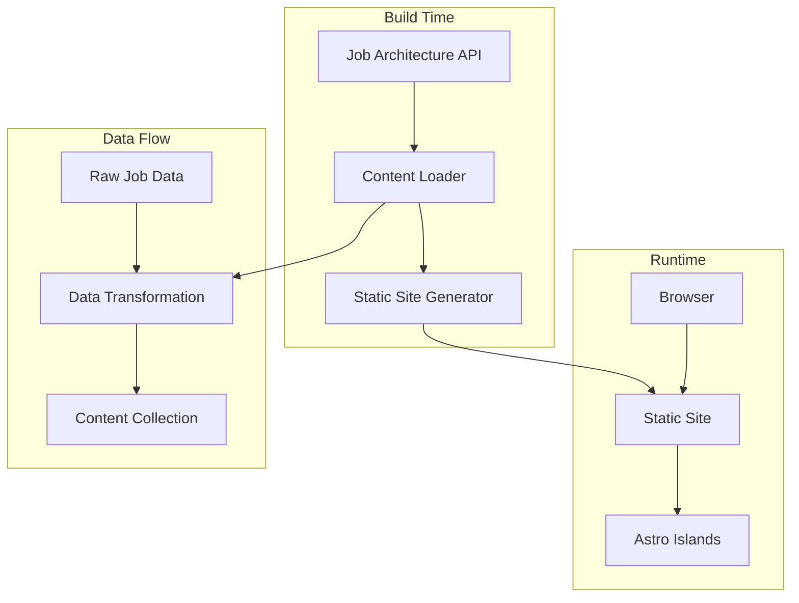
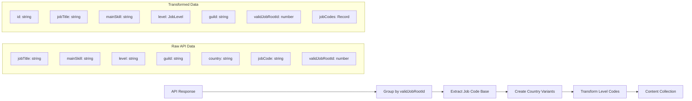
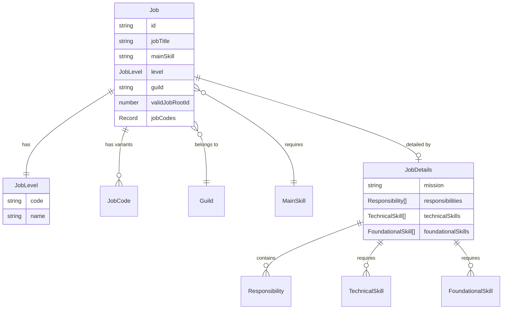
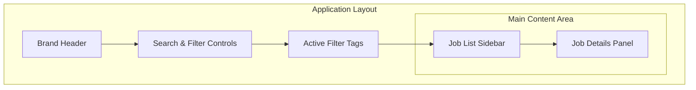
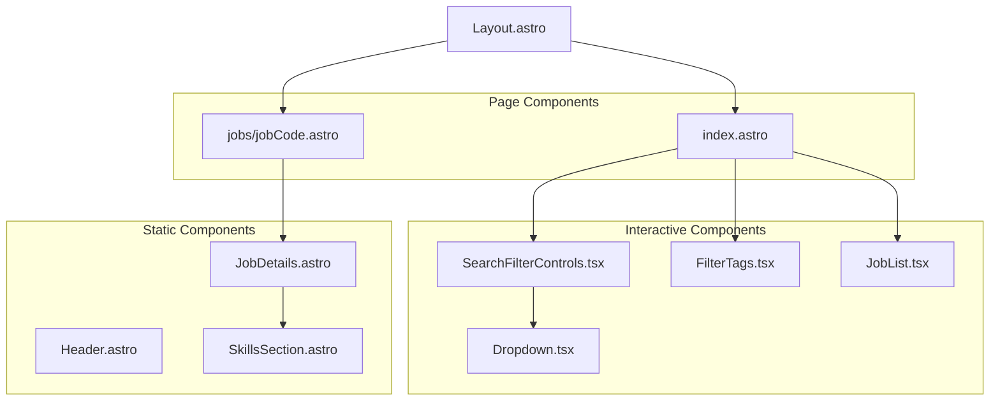
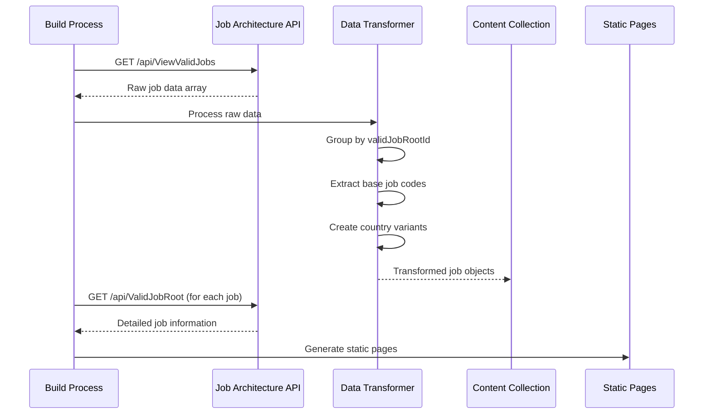
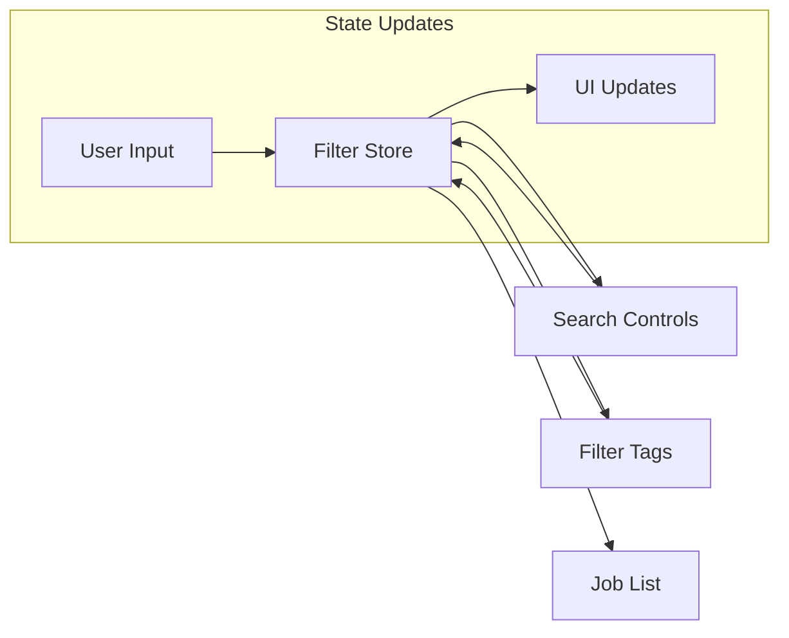
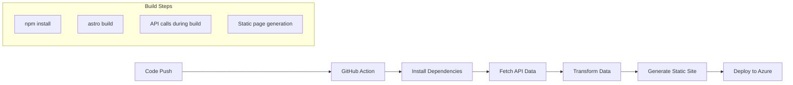

# Job Explorer

A modern, static-generated web application for exploring job positions within an IT consulting firm. Built with Astro, React, and TailwindCSS, this application serves both delivery leaders for project composition and consultants for career path exploration.

## 📋 Table of Contents

- [Business Overview](#-business-overview)
- [Technical Architecture](#-technical-architecture)
- [Features](#-features)
- [Technology Stack](#-technology-stack)
- [Project Structure](#-project-structure)
- [Data Model](#-data-model)
- [User Interface](#-user-interface)
- [API Integration](#-api-integration)
- [Development](#-development)
- [Deployment](#-deployment)

## 🏢 Business Overview

### Purpose
Job Explorer is an internal business application designed to help the firm with two primary use cases:

1. **Delivery Leaders**: Project composition planning, requiring knowledge of job codes for revenue and margin projections.
2. **Consultants**: Career path exploration, providing access to job descriptions, responsibilities, and skill requirements

### Business Concepts

#### Guilds
Communities of practice that group related Main Skills together:
- **Backend Engineering**: .NET Developer, Java Developer, etc.
- **Digital Experience**: React Developer, UX Designer, Android Developer, etc.
- **Agility**: Scrum Master, Project Manager, etc.

#### Main Skills
Disciplines or areas of expertise that jobs are related to:
- Java Developer
- UX Designer
- Scrum Master
- Data Engineer
- Quality Architect

#### Job Levels
14-level career progression system (less to more seniority):
1. **F**: Intern
2. **E**: Trainee
3. **D**: Associate
4. **C**: Associate II
5. **B**: Intermediate
6. **A**: Intermediate II
7. **1**: Senior
8. **2**: Senior II
9. **3**: Principal
10. **4**: Principal II
11. **5**: Distinguished
12. **6**: Distinguished II
13. **7**: Fellow
14. **8**: Fellow II

#### Job Codes
6-character identifiers following the pattern: `[Guild][MainSkill][Level][Country]`
- **1st character**: Guild identifier
- **2nd-4th characters**: Main Skill identifier
- **5th character**: Job Level code
- **6th character**: Country code

Example: `BJVD1M` = Backend Engineering Guild, Java Developer, Senior level, Mexico

## 🏗 Technical Architecture

### Core Architecture Patterns



The application follows **Astro Islands Architecture**:
- **Static Generation**: All job data is fetched and processed at build time
- **Selective Hydration**: Only interactive components (filters, job list) use JavaScript
- **Performance First**: Minimal JavaScript bundle with fast initial load times

### Data Transformation Pipeline



## ✨ Features

### Core Functionality
- **Job Discovery**: Browse all available job positions within the firm
- **Advanced Filtering**: Multi-criteria filtering by Guild, Main Skill, Level, and text search
- **Job Details**: Comprehensive job information including mission, responsibilities, and skills
- **Multi-language Support**: Job details available in English, Spanish, and Portuguese
- **Responsive Design**: Optimized for desktop and mobile experiences

### Interactive Elements
- **Real-time Search**: Instant text-based job filtering
- **Multi-select Filters**: Select multiple criteria across different categories
- **Filter Tags**: Visual representation of active filters with easy removal
- **Dynamic Skill Filtering**: Main skills automatically filter based on selected guilds
- **Job Code Copying**: One-click copy of job codes to clipboard
- **Tab Navigation**: Organized job details across multiple tabs

## 🛠 Technology Stack

### Frontend Framework
- **[Astro 5.8.0](https://astro.build)**: Static site generator with component islands
- **[React 19.1.0](https://react.dev)**: UI library for interactive components
- **[TypeScript](https://www.typescriptlang.org)**: Type-safe JavaScript development

### Styling & UI
- **[TailwindCSS 4.1.7](https://tailwindcss.com)**: Utility-first CSS framework
- **CSS Grid & Flexbox**: Layout systems for responsive design
- **Custom CSS**: Component-specific styling in global.css

### State Management
- **[Nanostores 1.0.1](https://github.com/nanostores/nanostores)**: Lightweight state management
- **[@nanostores/react 1.0.0](https://github.com/nanostores/react)**: React integration for nanostores

### Build Tools
- **Vite**: Fast build tool and development server
- **ES Modules**: Modern JavaScript module system
- **TypeScript Compiler**: Type checking and transpilation

### Deployment
- **Azure Static Web Apps**: Cloud hosting with CI/CD integration

## 📁 Project Structure

```
/job-explorer/
├── public/                          # Static assets
│   ├── favicon.svg                  # Application favicon
│   └── logo/
│       └── motivus-logo.png         # Company branding
├── src/
│   ├── assets/                      # Build-time assets
│   │   ├── astro.svg
│   │   └── background.svg
│   ├── components/                  # Reusable UI components
│   │   ├── Dropdown.tsx             # Multi-select dropdown component
│   │   ├── FilterTags.tsx           # Active filter display
│   │   ├── Header.astro             # Application header
│   │   ├── JobDetails.astro         # Job detail view with tabs
│   │   ├── JobList.tsx              # Filterable job list
│   │   ├── SearchFilterControls.tsx # Search and filter controls
│   │   ├── SkillsSection.astro      # Skills display component
│   │   └── icons/                   # SVG icon components
│   │       ├── ChevronIcon.tsx
│   │       └── XMarkIcon.tsx
│   ├── layouts/
│   │   └── Layout.astro             # Base layout template
│   ├── pages/                       # Route definitions
│   │   ├── index.astro              # Home page (job list view)
│   │   └── jobs/
│   │       └── [jobCode].astro      # Dynamic job detail pages
│   ├── stores/                      # State management
│   │   └── filters.ts               # Filter state and logic
│   ├── styles/
│   │   └── global.css               # Global styling
│   ├── types/                       # TypeScript definitions
│   │   └── index.ts                 # Shared type definitions
│   ├── utils/                       # Utility functions
│   │   ├── jobDetailsApi.ts         # Job details API client
│   │   ├── jobTransforms.ts         # Data transformation logic
│   │   ├── languages.ts             # Multi-language configuration
│   │   └── skillTransforms.ts       # Skills data processing
│   └── content.config.ts            # Content collection configuration
├── astro.config.mjs                 # Astro configuration
├── azure-static-web-apps-*.yml      # Azure deployment configuration
├── package.json                     # Dependencies and scripts
├── tsconfig.json                    # TypeScript configuration
└── CLAUDE.md                        # Project documentation and guidelines
```

## 🗂 Data Model

### Core Entities

#### Job Interface
```typescript
interface Job {
  id: string;                        // Job code without country suffix
  jobTitle: string;                  // Human-readable job title
  mainSkill: string;                 // Primary skill/discipline
  level: JobLevel;                   // Career level information
  guild: string;                     // Guild/community classification
  validJobRootId: number;            // Unique job identifier
  jobCodes: Record<string, string>;  // Country -> job code mapping
}
```

#### JobLevel Interface
```typescript
interface JobLevel {
  code: string;    // Single character level code (F, E, D, C, B, A, 1-8)
  name: string;    // Human-readable level name
}
```

#### JobDetails Interface
```typescript
interface JobDetails {
  mission: string;                      // Job purpose and description
  responsibilities: Responsibility[];   // List of job responsibilities
  technicalSkills: TechnicalSkill[];   // Required technical skills
  foundationalSkills: FoundationalSkill[]; // Required soft skills
}
```

### Data Relationships



## 🎨 User Interface

### Layout Architecture



### Component Hierarchy



### Responsive Design Strategy

- **Mobile First**: TailwindCSS breakpoints for progressive enhancement
- **Grid Layout**: CSS Grid for main content areas
- **Flexbox**: Component-level flexible layouts
- **Utility Classes**: Consistent spacing and sizing patterns

## 🔌 API Integration

### Data Sources

#### Primary API Endpoint
- **URL**: `https://job-arch-app-service-2.azurewebsites.net/api/ViewValidJobs`
- **Method**: GET
- **Purpose**: Retrieve all valid job positions
- **Timing**: Build time only

#### Job Details API
- **URL**: `https://job-arch-app-service-2.azurewebsites.net/api/ValidJobRoot`
- **Parameters**: 
  - `validJobRootId`: number
  - `language`: string (English, Spanish, Portuguese)
- **Purpose**: Get detailed job information
- **Timing**: Build time for static pages

### API Data Flow



## 🚀 Development

### Getting Started

```bash
# Clone the repository
git clone <repository-url>
cd job-explorer

# Install dependencies
npm install

# Start development server
npm run dev

# Build for production
npm run build
```

### Available Scripts

| Command | Description |
|---------|-------------|
| `npm run dev` | Start development server at `localhost:4321` |
| `npm run build` | Build production site to `./dist/` |
| `npm run preview` | Preview production build locally |
| `npm run astro` | Run Astro CLI commands |

### Development Guidelines

#### Code Standards
- **ES Modules**: Use import/export syntax
- **TypeScript**: Strict type checking enabled
- **Destructuring**: Prefer destructured imports
- **Modern JavaScript**: Use latest language features
- **Browser APIs**: Prefer native APIs over external libraries

#### Architecture Principles
- **Astro First**: Prefer Astro components over React when possible
- **Static Generation**: Favor build-time data processing
- **Islands Architecture**: Minimize JavaScript for interactivity only
- **Performance**: Optimize for Core Web Vitals
- **Accessibility**: Follow WCAG 2.1 guidelines

### State Management Pattern

The application uses a centralized filtering system:

```typescript
// Filter state management
export const filtersStore = atom<FilterState>({
  search: '',
  guilds: [],
  mainSkills: [],
  levels: []
})

// Computed filtered results
export const filteredJobsStore = computed(filtersStore, (filters) => {
  return (jobs: Job[]) => {
    return jobs.filter(job => {
      // Apply all active filters
      return matchesAllCriteria(job, filters)
    })
  }
})
```

### Component Communication



## 🚀 Deployment

### Azure Static Web Apps

The application is deployed using Azure Static Web Apps with the following configuration:

```yaml
# Azure pipeline configuration
app_location: "/"           # App source code path
api_location: ""            # No API backend
output_location: "dist"     # Astro build output
```

### Build Process



### Environment Considerations

- **Build Time**: API data fetched during build process
- **Static Content**: No runtime API dependencies
- **Performance**: CDN-delivered static assets
- **Scalability**: Automatic scaling with Azure infrastructure

### CI/CD Pipeline

1. **Trigger**: Push to main branch or pull request
2. **Build**: Ubuntu latest with Node.js environment
3. **Test**: TypeScript compilation and build verification
4. **Deploy**: Automatic deployment to Azure Static Web Apps
5. **Rollback**: Previous version maintained for quick recovery

---

## 📄 License

This project is proprietary and confidential. © Motivus, all rights reserved.

---